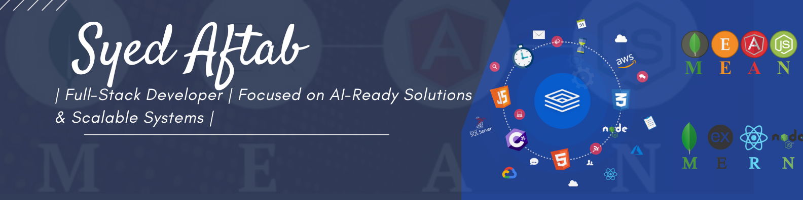

<h1 align="center">Hi 👋, I'm Syed Muhammad Aftab</h1>
<h3 align="center">A passionate Full Stack and Frontend Developer based in the United Kingdom 🇬🇧</h3>

  

- 🔭 I’m currently building dynamic web platforms with **Angular**, **TypeScript**, and **Node.js** at scale.
  
- 🌱 I’m enhancing my expertise in **AWS Cloud Services**, **Advanced JavaScript Patterns**, and **Full Stack Architectures**.

- 👯 I’m looking to collaborate on **real-time applications** using **React**, **Firebase**, **WebSockets**, and **AWS** to build responsive and scalable products.

- 💬 Ask me about **Angular**, **React**, **TypeScript**, **Node.js**, **UX/UI Best Practices**, **Performance Optimization**, and **CI/CD Pipelines**.

- 📫 Reach me at **shahaftab5100@gmail.com**

- ⚡ **Fun Fact:** I love polishing micro-interactions and UI animations until they’re pixel-perfect! ✨

---

<h3 align="left">🌐 Connect with me:</h3>

  

<h3 align="left">💻 Languages and Tools:</h3>

  
  
  
  
  
  
  
  
  
  
  
  
  

---
